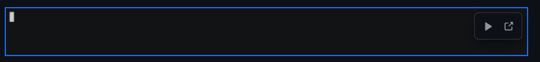

+++
title = "stupid github stuff"
authors = ["pspiagicw"]
date = 2024-06-10
draft = false
summary = "Github added some stuff in their README rendering, just exploring those!"
+++

If you have been reading a few GitHub README's lately, you would have observed few glaring changes.

# GIFS 

`gifs` have a play/pause button. Irrespective if you add it through HTML or markdown.



# Markdown Alerts

If you have a blockquote, 

> that is this exact text.

You can add some additional stuff. You can add `[!IMPORTANT]` to denote it's important.
It will render with full-on colors and everything.

It's not only restricted to `IMPORTANT`. The exact markdown excerpt is copied verbatim from GitHub's official guide.

You can check it out later [here](https://docs.github.com/en/get-started/writing-on-github/getting-started-with-writing-and-formatting-on-github/basic-writing-and-formatting-syntax#alerts).
This is more of a TLDR;

```markdown {linenos=false}
> [!NOTE]
> Useful information that users should know, even when skimming content.

> [!TIP]
> Helpful advice for doing things better or more easily.

> [!IMPORTANT]
> Key information users need to know to achieve their goal.

> [!WARNING]
> Urgent info that needs immediate user attention to avoid problems.

> [!CAUTION]
> Advises about risks or negative outcomes of certain actions.
```

It's rendered like this


Hopefully this helps a fellow markdowne craft his next masterpiece.
